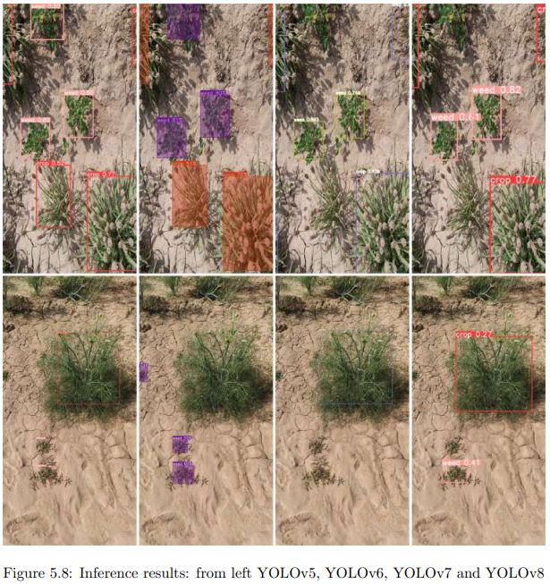
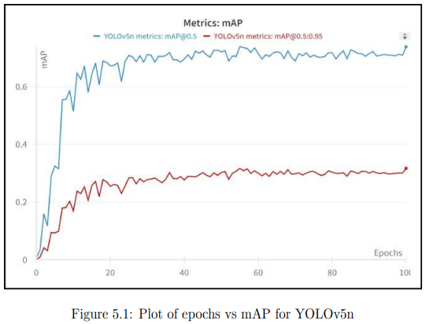
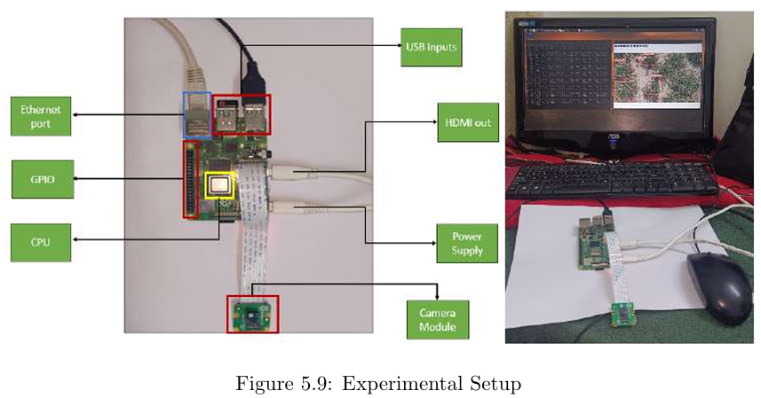

# Autonomous Image-Based Weed Detection System for Smart Agriculture

## 📄 Abstract
This repository hosts the documentation and experimental results for my Master's Thesis titled **"Autonomous Image-Based Weed Detection System for Smart Agriculture."**

The project addresses the need for cost-effective precision agriculture in India by deploying deep learning models on edge devices. We performed a comparative analysis of lightweight YOLO architectures (v5 through v8) to detect weeds in **Fennel and Psyllium (Jeera/Isabgol)** crops. The goal was to find the optimal balance between accuracy (mAP) and inference speed (FPS) on a **Raspberry Pi 4 Model B**.

> **Note:** This repository serves as a portfolio archive. The complete dataset and raw training weights are stored locally.

## 📥 Read the Thesis
For the complete methodology, mathematical background, and error analysis, please refer to the full report:
[**📄 Click here to view the Master's Thesis (PDF)**](./MTP_Report.pdf)

## 🛠️ Methodology
* **Dataset:** Custom dataset of **1,300+ images** collected from local farmlands using smartphone cameras.
* **Classes:** The model is trained to distinguish between two specific classes: `Crop` and `Weed`.
* **Preprocessing:** Images were resized, augmented (rotation/cropping), and annotated using MakeSense.ai.
* **Hardware:** Raspberry Pi 4 Model B (4GB RAM) with active cooling considerations.

## 📊 Key Results
We compared four lightweight YOLO variants. **YOLOv5-nano** emerged as the best performer for this specific dataset, achieving the highest mAP and a usable frame rate on the Raspberry Pi without a dedicated GPU.

| Model Version | Parameters | Model Size | Best mAP@0.5 | Inference (Pi CPU) |
|:-------------:|:----------:|:----------:|:------------:|:------------------:|
| **YOLOv5-nano**| **1.7M** | **3.65 MB**| **0.738** | **~200ms (5 FPS)** |
| YOLOv6-lite   | 1.09M      | 2.42 MB    | 0.661        | ~260ms             |
| YOLOv7-tiny   | 2.3M       | 4.69 MB    | 0.638        | ~220ms             |
| YOLOv8-nano   | 3.0M       | 5.94 MB    | 0.657        | ~230ms             |

**Conclusion:** YOLOv5n proved to be the most effective for edge deployment, achieving **5 FPS** on the Raspberry Pi CPU, which is sufficient for real-time robotic weeding applications.

## 📸 Visuals

### 1. Real-World Detection
*Detection of crops vs. weeds on the custom dataset.*

### 2. Training Performance (YOLOv5n)
*The model reached convergence around 30 epochs, achieving a stable mAP of 0.738.*

### 3. Edge Deployment Setup
*The experimental setup involving the Raspberry Pi 4B and Camera Module.*

